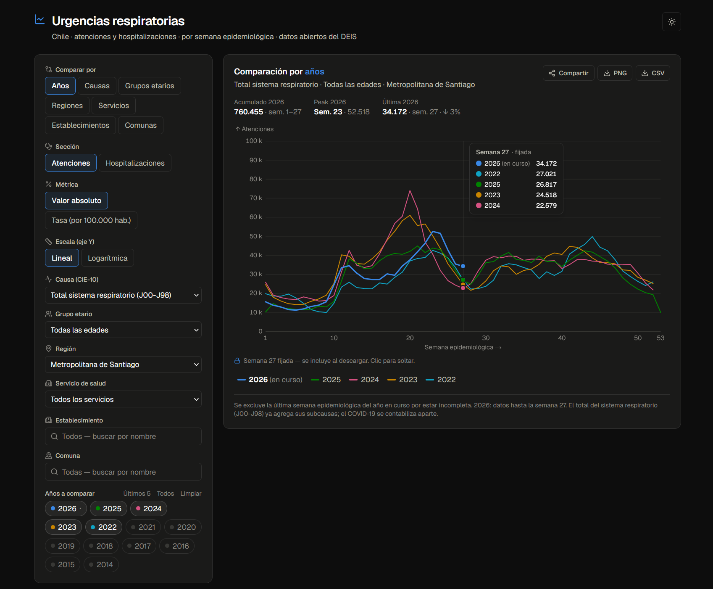
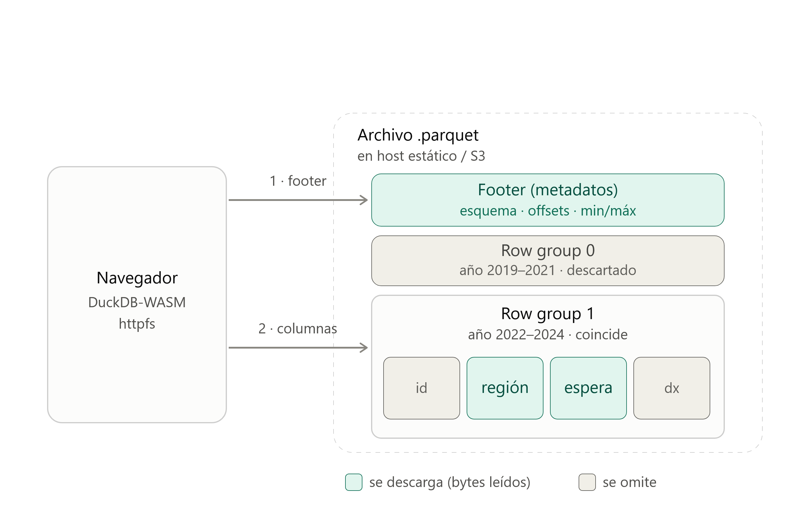

# Urgencias respiratorias en Chile

Visualizador web de las **atenciones y hospitalizaciones de urgencia por causas
respiratorias** en Chile, por semana epidemiológica. Permite:

- **Comparar por cualquier dimensión** —años, causas (CIE-10), grupos etarios,
  regiones, servicios de salud, **establecimientos** o **comunas**— con las demás
  como filtro de contexto.
- Alternar entre **atenciones** y **hospitalizaciones** (toggle de *Sección*).
- Ver **tasas por 100.000 habitantes** (al comparar años, regiones, servicios o
  comunas, ajustadas por grupo etario y área).
- Cambiar el eje Y entre escala **lineal y logarítmica**.
- **Resaltar** una serie entre muchas (pasar el cursor por la leyenda; clic para
  fijarla).
- **Compartir** la vista por enlace (los filtros viven en la URL) y **exportar** a
  **PNG** o **CSV**.

Sitio estático que se **actualiza a diario** desde los datos abiertos del DEIS
(Ministerio de Salud).

**[▶ Ver el visor en vivo](https://paulovillarroel.github.io/atenciones-urgencia/)**



- **Fuente:** [Atenciones de urgencia – causas respiratorias](https://datos.gob.cl/dataset/atenciones-de-urgencia-causas-respiratorias) (datos.gob.cl / DEIS).
- **Gráfico:** eje X = semana epidemiológica, eje Y = volumen de atenciones u
  hospitalizaciones (o su tasa); una línea por cada valor de la dimensión que compares.
- **Stack:** Next.js 16 (export estático) · React 19 · Tailwind v4 · Observable Plot ·
  DuckDB (pipeline en Node + DuckDB-WASM en el navegador).

## Cómo funciona

1. Un script (`scripts/build-data.mjs`) descarga el parquet del DEIS (~67 MB) y con
   **DuckDB** lo limpia y lo **pre-agrega** a un JSON columnar compacto en
   `public/data/` (grano: año × semana × región × servicio × causa).
2. La app estática (Next.js `output: "export"`) carga ese JSON y **filtra y grafica
   del lado del cliente** (sin servidor, sin bajar los 67 MB).
3. Las dimensiones finas —**establecimiento** y **comuna**, que son cientos— no caben
   pre-agregadas: se consultan en el navegador con **DuckDB-WASM** sobre un
   `detalle.parquet` leído por rangos HTTP, con búsqueda por texto.
4. El estado de los filtros vive en la **URL**, así cada vista es enlazable y compartible.
5. Una **GitHub Action** repite el pipeline y publica en GitHub Pages **cada día**
   (y en cada push).

## Consultar el parquet desde el navegador (range reads)

El `detalle.parquet` (nivel establecimiento/comuna) no se descarga entero:
DuckDB-WASM lo consulta con SQL leyendo **solo los bytes que cada consulta
necesita**, vía **HTTP Range Requests**. En la práctica es un pequeño "data lake"
sobre un host estático, consultado desde el cliente sin ningún backend.



Encajan tres piezas:

- **HTTP Range Requests.** El cliente pide un tramo de bytes
  (`Range: bytes=1024-2048`) y el servidor responde `206 Partial Content` con solo
  ese fragmento, en vez de `200 OK` con todo el archivo. Lo soporta cualquier host
  que anuncie `Accept-Ranges: bytes` (incluido el CDN de GitHub Pages).
- **La estructura de Parquet.** Es columnar: el archivo se divide en *row groups*
  (bloques de filas); dentro de cada uno, cada columna vive junta en un *column
  chunk*; y un *footer* al final guarda el esquema, el offset de cada chunk y
  estadísticas min/máx por chunk.
- **DuckDB-WASM.** DuckDB compilado a WebAssembly, con la extensión `httpfs`,
  orquesta todo dentro del navegador.

Recorrido de una consulta como `SELECT region, total FROM detalle.parquet WHERE …`:

1. Lee el **footer** con una Range Request pequeña → aprende el layout y las
   estadísticas del archivo.
2. **Projection pushdown:** solo baja las columnas del `SELECT`; los offsets del
   resto de columnas se ignoran.
3. **Predicate pushdown:** con las estadísticas min/máx **descarta row groups
   enteros** que no pueden cumplir el `WHERE`, sin llegar a tocarlos.
4. Emite Range Requests dirigidas únicamente a los column chunks que sobreviven a
   ambos filtros.

Sobre un parquet de varios GB, una consulta selectiva puede transferir apenas unos
MB. Como el `WHERE` real filtra por comuna/establecimiento, el pipeline escribe el
`detalle.parquet` **ordenado por esas columnas** (`ORDER BY comuna, establecimiento`):
así las filas de cada zona quedan contiguas, las estadísticas min/máx separan limpio
y el *pruning* descarta más row groups.

## Desarrollo local

Requiere Node 20+ (probado en Node 24).

```bash
npm install
npm run data     # descarga y pre-agrega los datos -> public/data/ (necesario la 1a vez)
npm run dev      # http://localhost:3000
```

Otros comandos:

```bash
npm run build    # export estático a ./out
npm run lint
```

> `public/data/` está en `.gitignore`: los datos se regeneran con `npm run data` y en
> cada despliegue. Si abres la app sin haberlos generado, verás un aviso pidiéndote
> correr `npm run data`.

## Desplegar en GitHub Pages

1. Sube el repositorio a GitHub (rama `main`).
2. En **Settings → Pages**, en *Build and deployment → Source*, elige **GitHub Actions**.
3. Listo. El workflow `.github/workflows/deploy.yml` construye y publica en cada push,
   a diario (cron 11:00 UTC) y de forma manual (*Actions → Run workflow*).

El workflow calcula solo el *base path*: en una **página de proyecto** el sitio queda
en `https://<usuario>.github.io/<repo>/`; en una página de usuario
(`<usuario>.github.io`) queda en la raíz. La URL absoluta que usan las tarjetas
sociales (Open Graph) está en `app/layout.tsx` (constante `SITIO`).

## Decisiones sobre los datos

- **Atenciones y hospitalizaciones.** El dataset trae, además de las atenciones de
  urgencia (`OrdenCausa` 3–11), cuántas derivaron en **hospitalización**
  (`OrdenCausa` 33/34/35, prefijo `- `: total respiratorio + dos tipos de COVID). El
  toggle *Sección* cambia entre ambas: distinto set de causas y etiqueta del eje.
- **Semana incompleta.** Se descarta la última semana epidemiológica del año en curso
  por estar incompleta. En el año en curso la semana 53 es la *primera* (arrastre de
  inicio de enero), así que "última" es la de mayor número del bloque contiguo 1..N,
  no la 53. La regla es dinámica (no hay años fijados en el código). El eje X llega
  hasta la última semana con datos (evita media cancha vacía en el año en curso).
- **Sin doble conteo.** `OrdenCausa = 3` (*Total sistema respiratorio, J00-J98*) ya es la
  suma de sus subcausas (4–9); el COVID-19 (10/11) se contabiliza aparte. El gráfico
  nunca suma sobre todas las causas.
- **Glosas normalizadas por código.** El origen trae typos de glosa (Región 14
  "Los/los Ríos", Servicio 25 "Aysén/Aisén", etc.). Se normaliza por código: **16
  regiones y 29 servicios de salud**. Las ~0,7 % de filas con código nulo se conservan
  solo en el total nacional ("Todas"), no como opción filtrable.
- **Grupos etarios.** El dato trae los conteos por edad en columnas anchas
  (`<1`, `1–4`, `5–14`, `15–64`, `≥65`); el filtro de grupo etario selecciona la columna.
- **Tasas por 100.000 hab.** Al comparar **años, regiones, servicios de salud o
  comunas** se puede cambiar de valor absoluto a tasa. El denominador se **ajusta al
  contexto**: al grupo etario elegido (población por banda de edad) y al área
  geográfica. Población **territorial (residente) del INE** (Estimaciones y
  Proyecciones 2002–2035, base Censo 2017), **por año** y por banda etaria. Región,
  comuna y país se agregan del cuadro comunal INE; el total por servicio (sin serie
  etaria oficial) se distribuye por la estructura etaria de su región. No usa población
  beneficiaria FONASA. La tabla vive en `scripts/poblacion.mjs` (horneada en el repo:
  no se regenera en CI).

## Estructura

```
scripts/build-data.mjs   Pipeline (DuckDB en Node): descarga, limpia, pre-agrega y escribe detalle.parquet
scripts/poblacion.mjs    Población INE por año/banda (región, servicio, comuna, país) para tasas
public/data/             Datos generados (JSON columnar + lookups + meta + detalle) — gitignored
public/og.png            Imagen de la tarjeta social (Open Graph)
lib/                     Tipos, carga/agregación, consultas DuckDB-WASM, colores, formato, estado-en-URL
components/              Dashboard, filtros, gráfico (Observable Plot), buscador, tema
app/                     Next.js App Router (layout con metadata/OG, página, estilos)
.github/workflows/       GitHub Action (refresco diario + deploy a Pages)
```

## Créditos

- **Datos:** DEIS – Ministerio de Salud de Chile, publicados en datos.gob.cl.
- **Población (para tasas):** INE – Estimaciones y Proyecciones de Población de Chile 2002–2035, base Censo 2017.
- **Visualización y desarrollo:** [Paulo Villarroel Tapia](https://www.linkedin.com/in/paulovillarroel/).
- **Inspiración metodológica:** taller de datos abiertos en R, [paulovillarroel/api-datos-gob](https://github.com/paulovillarroel/api-datos-gob).
